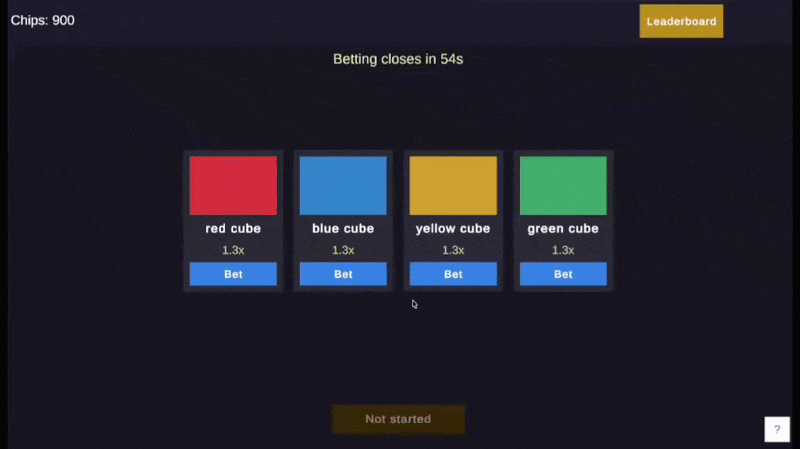
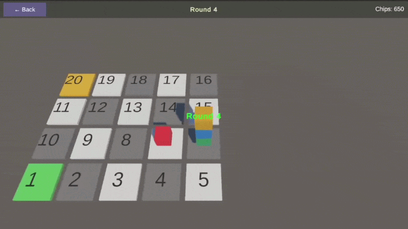

# Cube Racing

A simplified clone of the "小團快跑" mini-game from Wuthering Waves. Server-controlled NPC cubes race on a 20-square board while real players bet on the winner.

Built as a learning project for .NET backend + Unity frontend integration.

### Documentation

| Document | Description |
|---|---|
| [Architecture](docs/architecture.md) | Layer structure, game lifecycle, RabbitMQ pipeline, key design decisions |
| [Gameplay & Rules](docs/gameplay.md) | Board, NPCs, betting, race mechanics, settlement |
| [Communication Protocol](docs/communication-protocol.md) | REST endpoints and SignalR events by game phase |

---

## Tech Stack

| Layer | Technologies |
|---|---|
| **Backend** | .NET 9, Clean Architecture, MSSQL, RabbitMQ, SignalR |
| **Frontend** | Unity 6, URP, VContainer, R3, UniTask, MessagePipe, DOTween |
| **Auth** | Bearer token (player GUID) — no JWT |
| **Real-time** | SignalR over WebSocket (`/hubs/game`) |

---

## Game Flow

```
[Waiting 30s] → [Betting 60s] → [30s pre-race countdown] → [Racing] → [Settling] → [Completed] → (repeat)
```

4 NPC cubes race on a 20-square snake board. Players register, receive 1000 chips, and bet on any NPC during the betting window.



Players can enter the race scene to watch the race.



Winnings are calculated via odds.

---

## Project Structure

```
cube-racing/
├── backend/
│   ├── src/
│   │   ├── CubeRacing.API           # Controllers, DI wiring, middleware
│   │   ├── CubeRacing.Application   # Use cases, RaceSimulator, SettlementCalculator
│   │   ├── CubeRacing.Domain        # Entities, repository interfaces, domain events
│   │   └── CubeRacing.Infrastructure # EF Core, RabbitMQ, SignalR hub, background services
│   ├── tests/
│   │   └── CubeRacing.Tests         # xUnit, FluentAssertions, Moq, EF InMemory
│   └── docker-compose.yml
└── frontend/
    └── unity/
        └── Assets/Scripts/
            ├── Config/              # NpcConfig ScriptableObject
            ├── Core/                # GameStateService, PlayerSession, DTOs, Messages
            ├── Login/               # LoginScope, LoginPresenter
            ├── Lobby/               # LobbyPresenter, NpcCardView, BettingDialogPresenter, LeaderboardPresenter
            ├── Race/                # RacePresenter, BoardController, NpcCubeController
            ├── Network/             # ApiClient, SignalRClient
            └── Main.cs              # ProjectScope (VContainer root)
```

---

## Getting Started

### Prerequisites

- .NET 9 SDK
- Docker Desktop
- Unity 6 (6000.x)

### Backend — Option A: local dev (faster iteration)

```bash
cd backend

# Start MSSQL + RabbitMQ
docker compose up -d

# Run API (auto-migrates DB on startup)
dotnet run --project src/CubeRacing.API
```

API runs at `https://localhost:7xxx` — check `launchSettings.json` for the exact port. Swagger UI available at `/swagger`.

**Infrastructure:**
- MSSQL: `localhost:1433` (SA / `CubeRacing!123`)
- RabbitMQ management: `http://localhost:15672` (guest / guest)

### Backend — Option B: full Docker (no SDK required)

```bash
cd backend
docker compose up -d --build
```

Builds the API image and starts API + MSSQL + RabbitMQ together. API available at `http://localhost:8080`. MSSQL and RabbitMQ healthchecks gate the API startup; DB is auto-migrated on first boot.

### Frontend

1. Open `frontend/unity/` in Unity 6
2. Open `Assets/Scenes/LoginScene.unity`
3. In `Project Settings → Player → Other Settings`, set the API base URL if needed (default: `https://localhost:7xxx`)
4. Hit **Play**

**Scene order (build index):**

| Index | Scene | Description |
|---|---|---|
| 0 | LoginScene | Nickname input, PlayerPrefs session persistence |
| 1 | LobbyScene | NPC cards, betting, leaderboard |
| 2 | RaceScene | Live race with animated cubes |

### Tests

```bash
cd backend

dotnet test                                                          # all tests
dotnet test --filter "FullyQualifiedName~RaceSimulatorTests"         # race logic only
dotnet test --filter "FullyQualifiedName~PlaceBetIntegrationTests"   # betting flow only
```

---

## Architecture

### Backend — Clean Architecture

```
Domain ← Application ← Infrastructure ← API
```

- **Domain** — entities (`GameSession`, `Bet`, `Player`), repository interfaces, domain events
- **Application** — use cases (`PlaceBet`, `SettleSession`), `RaceSimulator`, `SettlementCalculator`
- **Infrastructure** — EF Core (MSSQL), RabbitMQ publisher/consumers, SignalR hub, background services
- **API** — controllers, `TokenAuthMiddleware`, DI composition in `Program.cs`

### RabbitMQ Pipeline

```
betting.ended   → BettingEndedConsumer   → sets RaceStartsAt, broadcasts RaceStarting, waits 30s → RaceSimulator → round.executed (×N)
round.executed  → RoundExecutedConsumer  → SignalR broadcast (RoundExecuted)
race.completed  → RaceCompletedConsumer  → SettleSession use case
settlement.done → SettlementDoneConsumer → ISessionCompletionSignal.Signal()
```

All consumers: durable queues, `BasicQos(0,1,false)`, 3-attempt retry with 1s delay.

### Frontend — VContainer Scope Hierarchy

```
ProjectScope  (singleton: ApiClient, SignalRClient, GameStateService, PlayerSession, NpcConfig)
├── LoginScope
├── LobbyScope
└── RaceScope
```

`GameStateService` holds `ReactiveProperty<T>` for all shared state. Presenters subscribe via R3 and update UI reactively. `SignalRClient` publishes typed messages via MessagePipe; `GameStateService` subscribes and updates properties.

### Real-time Protocol

SignalR over `ClientWebSocket`. Handshake: `{"protocol":"json","version":1}\x1e`. Messages are `\x1e`-delimited JSON. Ping frames (type=6) are consumed silently. Auto-reconnect: on disconnect, waits 3s then reconnects and re-joins the current session.

**Server-to-client events:**

| Event | Payload | When |
|---|---|---|
| `OddsUpdated` | `[{ npcId, odds }]` | Bet placed |
| `BettingEnded` | — | Betting phase closes |
| `RaceStarting` | `{ sessionId, raceStartsAt: DateTime }` | 30s before round 1 |
| `RoundExecuted` | `{ roundNumber, actions, squareStacks, winner? }` | Each round |
| `RaceCompleted` | `{ winnerNpcId }` | Race ends |
| `SettlementDone` | `{ winnerNpcId, playerResults, topLeaderboard }` | Settlement complete |

### Settlement (Pari-Mutuel)

```
odds      = totalPool / poolOnWinner
winAmount = floor(betAmount × odds)
```

If no one bet on the winner, `winAmount = 0` for all bets. Pool is not redistributed.

---

## NPC Configuration

NPCs are defined in `backend/src/CubeRacing.API/appsettings.json` — not persisted to DB:

```json
"Npcs": [
  { "Id": 1, "Name": "ref cube", "ColorHex": "#E53E3E" },
  { "Id": 2, "Name": "blue cube", "ColorHex": "#3182CE" },
  { "Id": 3, "Name": "yellow cube", "ColorHex": "#D69E2E" },
  { "Id": 4, "Name": "green cube", "ColorHex": "#38A169" }
]
```

The same IDs and colors are mirrored in the Unity `NpcConfig` ScriptableObject (`Assets/Scenes/Data/NpcConfig.asset`).